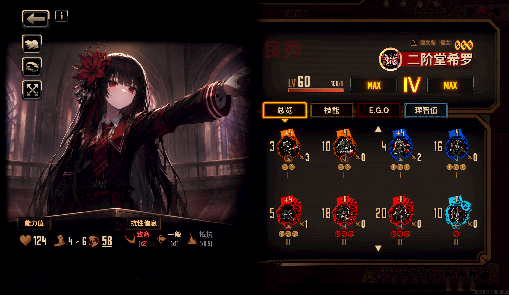
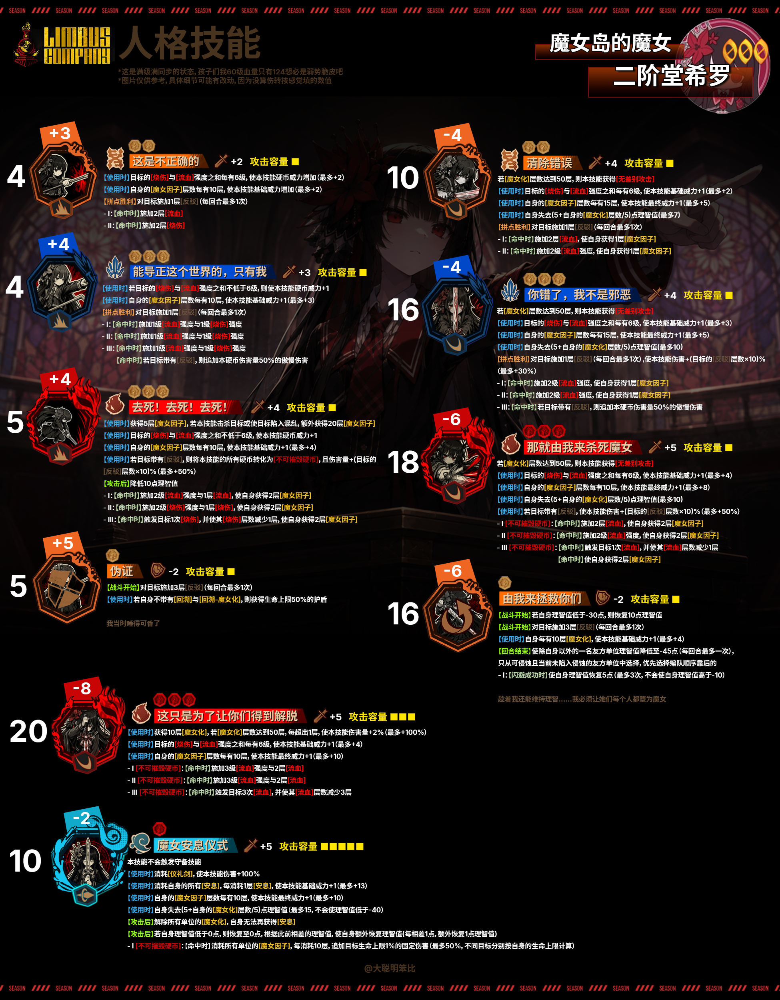
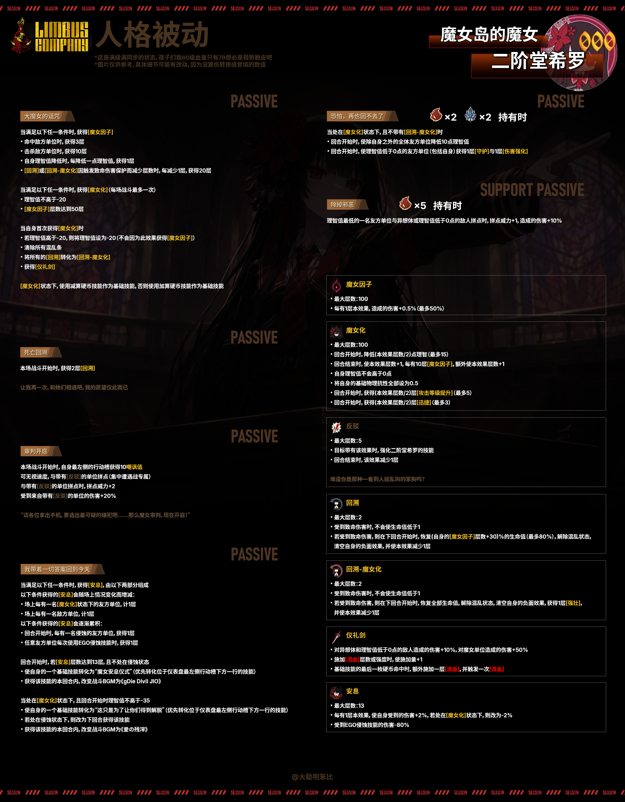

# 二阶堂希罗人格mod



## 安装

1. 从本仓库的 [Releases](https://github.com/LiHua5487/Limbus-NikaidouHiro-Mod/releases) 下载 ZIP
2. 将其中的 `NikaidouHiro-Identity` 文件夹放到 `./LetheLauncher-Distribution-7/BepInEx/plugins/Lethe/mods`
3. 将其中的 `NikaidouHiro.dll` 放到 `./LetheLauncher-Distribution-7/BepInEx/plugins/`

安装后目录结构应为：

```text
./LetheLauncher-Distribution-7/BepInEx/plugins/
├── NikaidouHiro.dll
└── Lethe/
    └── mods/
        └── NikaidouHiro-Identity/
            ├── custom_appearance/
            ├── custom_buffs/
            ├── custom_limbus_data/
            ├── custom_limbus_locale/
            ├── custom_motions/
            ├── custom_sounds/
            ├── custom_sprites/
            ├── custom_unit_keywords/
            └── modular_lua/
```

## 人格介绍

> **所属罪人：良秀**

### 基础面板

- 基础体力：40，成长系数：1.4
- 防御补正：-2
- 混乱阈值：80% 50% 20%
- 速度：4～6
- 物理抗性：斩击×2 突刺×1 打击×0.5
- 标签：魔女岛、魔女

### 饼图




### 技能

#### 常态

**S1：这是不正确的 【色欲/打击/+2/■】**  
3+4+4  
【使用时】 目标的[烧伤]与[流血]强度之和每有6级，使本技能硬币威力+1（最多+2）  
【使用时】 自身的[魔女因子]层数每有10层，使本技能基础威力+1（最多+2）  
【拼点胜利】 对目标施加1层[反驳]（自身所有基础攻击技能每回合最多1次）  
- I：【命中时】 施加2层[流血]
- II：【命中时】 施加2层[烧伤]

**S2：能导正这个世界的，只有我 【傲慢/打击/+3/■】**  
4+4+4+4  
【使用时】 若目标的[烧伤]与[流血]强度之和不低于6级，则使本技能硬币威力+1  
【使用时】 自身的[魔女因子]层数每有10层，使本技能基础威力+1（最多+3）  
【拼点胜利】 对目标施加1层[反驳]（自身所有基础攻击技能每回合最多1次）  
- I：【命中时】 施加1级[流血]强度与1级[烧伤]强度
- II：【命中时】 施加1级[流血]强度与1级[烧伤]强度
- III：【命中时】 施加1级[流血]强度与1级[烧伤]强度  
  【命中时】 若目标带有[反驳]，则追加本硬币伤害量50%的傲慢伤害

**S3：去死！去死！去死！ 【愤怒/打击/+4/■】**  
5+4+4+4  
【使用时】 使自身获得5层[魔女因子]；若本技能击杀目标或使目标陷入混乱，额外获得20层[魔女因子]  
【使用时】 若目标的[烧伤]与[流血]强度之和不低于6级，则使本技能硬币威力+1  
【使用时】 自身的[魔女因子]层数每有10层，使本技能基础威力+1（最多+4）  
【使用时】 若目标带有[反驳]，则将本技能的所有硬币转化为【不可摧毁硬币】，且伤害量+（目标的[反驳]层数×10）%（最多+50%）  
【使用后】 自身失去10点理智值  
- I：【命中时】 施加2级[流血]强度与1层[流血]  
  【命中时】 使自身获得2层[魔女因子]
- II：【命中时】 施加2级[烧伤]强度与1层[烧伤]  
  【命中时】 使自身获得2层[魔女因子]
- III：【命中时】 触发目标1次[烧伤]，随后使其[烧伤]层数-1  
  【命中时】 使自身获得2层[魔女因子]

**守备技能：伪证 【色欲/防御/-2/■】**  
5+5  
【战斗开始时】 对目标施加3层[反驳]（每回合最多1次）  
【使用时】 若自身不带有[回溯]与[回溯-魔女化]，则获得相当于生命上限50%的护盾  

#### 魔女化

**S1：清除错误 【色欲/斩击/+4/■】**  
10-4-4  
[魔女化]减算硬币技能  
[魔女化]达到50层时，本技能获得[无差别攻击]  
【使用时】 目标的[烧伤]与[流血]强度之和每有6级，使本技能基础威力+1（最多+2）  
【使用时】 自身的[魔女因子]层数每有15层，使本技能最终威力+1（最多+5）  
【使用时】 自身失去（5+自身的[魔女化]层数/5）点理智值（最多7点）  
【拼点胜利】 对目标施加1层[反驳]（自身所有基础攻击技能每回合最多1次）  
- I：【命中时】 施加2层[流血]  
  【命中时】 使自身获得1层[魔女因子]
- II：【命中时】 施加2级[流血]强度  
  【命中时】 使自身获得1层[魔女因子]

**S2：你错了，我不是邪恶 【傲慢/斩击/+4/■】**  
16-4-4-4  
[魔女化]减算硬币技能  
[魔女化]达到50层时，本技能获得[无差别攻击]  
【使用时】 目标的[烧伤]与[流血]强度之和每有6级，使本技能基础威力+1（最多+3）  
【使用时】 自身的[魔女因子]层数每有15层，使本技能最终威力+1（最多+5）  
【使用时】 自身失去（5+自身的[魔女化]层数/5）点理智值（最多10点）  
【拼点胜利】 对目标施加1层[反驳]（自身所有基础攻击技能每回合最多1次）；若目标带有[反驳]，使本技能伤害量+（目标的[反驳]层数×10）%（最多+30%）  
- I：【命中时】 施加2级[流血]强度  
  【命中时】 使自身获得1层[魔女因子]
- II：【命中时】 施加2级[流血]强度  
  【命中时】 使自身获得1层[魔女因子]
- III：【命中时】 若目标带有[反驳]，则追加本硬币伤害量50%的傲慢伤害

**S3：那就由我来杀死魔女 【愤怒/斩击/+5/■】**  
18-6-6-6  
[魔女化]减算硬币技能  
[魔女化]达到50层时，本技能获得[无差别攻击]  
【使用时】 目标的[烧伤]与[流血]强度之和每有6级，使本技能基础威力+1（最多+4）  
【使用时】 自身的[魔女因子]层数每有10层，使本技能最终威力+1（最多+8）  
【使用时】 自身失去（5+自身的[魔女化]层数/5）点理智值（最多10点）  
【使用时】 若目标带有[反驳]，使本技能伤害量+（目标的[反驳]层数×10）%（最多+50%）  
- I：【不可摧毁硬币】  
  【命中时】 施加2层[流血]  
  【命中时】 使自身获得2层[魔女因子]
- II：【不可摧毁硬币】  
  【命中时】 施加2级[流血]强度  
  【命中时】 使自身获得2层[魔女因子]
- III：【不可摧毁硬币】  
  【命中时】 触发目标1次[流血]，随后使其[流血]层数-1  
  【命中时】 使自身获得2层[魔女因子]

**守备技能：由我来拯救你们 【色欲/闪避/-2/■】**  
16-6  
【战斗开始时】 若自身理智值低于-20点，则恢复10点理智值  
【战斗开始时】 对目标施加3层[反驳]（每回合最多1次）  
【使用时】 自身每有10层[魔女化]，使本技能基础威力+1（最多+4）  
【战斗结束时】 使除自身以外的1名友方单位的理智值降低至-45点（每回合最多1次）；只从可侵蚀且当前未陷入侵蚀的友方单位中选择，优先选择编队顺序靠后的单位  
- I：【闪避成功时】 使自身恢复5点理智值（最多3次，不会使自身理智值高于-10点）

#### 特殊技能

**S3-1：这只是为了让你们得到解脱 【愤怒/斩击/+5/■ ■ ■】**  
20-8-8-8  
【使用时】 使自身获得10层[魔女化]；[魔女化]达到50层后，每超出1层，使本技能伤害量+2%（最多+100%）  
【使用时】 目标的[烧伤]与[流血]强度之和每有6级，使本技能基础威力+1（最多+4）  
【使用时】 自身的[魔女因子]层数每有10层，使本技能最终威力+1（最多+10）  
- I：【不可摧毁硬币】  
  【命中时】 施加3级[流血]强度与2层[流血]
- II：【不可摧毁硬币】  
  【命中时】 施加3级[流血]强度与2层[流血]
- III：【不可摧毁硬币】  
  【命中时】 触发目标3次[流血]，随后使其[流血]层数-3

**S3-2：魔女安息仪式 【忧郁/突刺/+5/■ ■ ■ ■ ■】**  
10-2  
本技能不会触发守备技能  
本技能无法因外部效果而重复使用  
【使用时】 消耗[仪礼剑]，使本技能伤害量+100%  
【使用时】 消耗自身的所有[安息]；每消耗1层[安息]，使本技能基础威力+1（最多+13）  
【使用时】 自身的[魔女因子]层数每有10层，使本技能最终威力+1（最多+10）  
【使用时】 自身失去（5+自身的[魔女化]层数/5）点理智值（最多15点，不会使理智值低于-40点）  
【使用后】 解除所有单位的[魔女化]；此后自身无法再获得[安息]  
【使用后】 若自身理智值低于0点，则恢复至0点，并根据此前与0点相差的理智值额外恢复等量理智值  
- I：【不可摧毁硬币】  
  【命中时】 消耗所有单位的[魔女因子]；每消耗10层，追加目标生命上限1%的固定伤害（最多50%；不同目标分别按自身生命上限计算）

### 被动

**大魔女的诅咒**
- 满足以下任一条件时，获得[魔女因子]：
  - 命中时，获得3层
  - 击杀时，获得10层
  - 自身理智值降低时，每降低1点理智值，获得1层
  - [回溯]或[回溯-魔女化]因触发致命伤害保护而减少层数时，每减少1层，获得20层
- 回合开始时，满足以下任一条件时，获得[魔女化]（每场战斗最多1次）：
  - 理智值不高于-20点
  - [魔女因子]达到50层
- 自身首次获得[魔女化]时：
  - 若理智值高于-20点，则将理智值设为-20点（不会因本效果获得[魔女因子]）
  - 清除所有混乱阈值
  - 将自身的[回溯]转化为[回溯-魔女化]
  - 获得[仪礼剑]
- 处于[魔女化]状态时，使用减算硬币技能作为基础技能；否则使用加算硬币技能作为基础技能

**死亡回溯**
- 本场战斗开始时，获得2层[回溯]

**审判开庭**
- 本场战斗开始时，自身最左侧的行动槽获得10点嘲讽值
- 可无视速度，与带有[反驳]的单位拼点（集中遭遇战专属）
- 与带有[反驳]的单位拼点时，拼点威力+2
- 受到来自带有[反驳]的单位的伤害+20%

**我带着一切答案回到今天**
- [安息]层数由当前统计与累积获得两部分相加，最多13层
- 当前统计会随场上情况变化而增减：
  - 场上每有1名处于[魔女化]状态的友方单位，计1层
  - 场上每有1名敌方单位，计1层
- 以下效果会累积获得[安息]：
  - 回合开始时，每有1名处于侵蚀状态的友方单位，获得1层
  - 任意友方单位每次使用E.G.O侵蚀技能时，获得1层
- 回合开始时，若[安息]达到13层，且自身不处于侵蚀状态：
  - 将自身的1个基础技能转化为“魔女安息仪式”（优先转化仪表盘最左侧行动槽下方一行的技能）
  - 获得该技能的本回合内，将战斗BGM改为“魔女们的安息”
- 处于[魔女化]状态，且回合开始时理智值不高于-35点：
  - 将自身的1个基础技能转化为“这只是为了让你们得到解脱”（优先转化仪表盘最左侧行动槽下方一行的技能）
  - 若自身处于侵蚀状态，则改为下回合获得该技能
  - 获得该技能的本回合内，将战斗BGM改为“大希王处刑曲”

**恐怕，再也回不去了 【持有 愤怒×2、傲慢×2】**
- 当自身处于[魔女化]状态，且不带有[回溯-魔女化]时：
- 回合开始时，使除自身以外的全体友方单位失去10点理智值
- 回合开始时，使理智值低于0点的友方单位（包括自身）获得1层[守护]与1层[伤害强化]

**支援被动：除掉邪恶 【持有 愤怒×5】**
- 理智值最低的1名友方单位与异想体或理智值低于0点的敌人拼点时，拼点威力+1，造成的伤害+10%

### Buff

**魔女因子**
- 最大层数：100
- 每有1层本效果，造成的伤害+0.5%（最多50%）

**魔女化**
- 最大层数：100
- 回合开始时，降低（本效果层数/2）点理智值（最多15点）
- 回合结束时，使本效果层数+1；每有10层魔女因子，额外使本效果层数+1
- 自身理智值不会高于0点
- 将自身的基础物理抗性全部设为0.5
- 回合开始时，获得（本效果层数/2）层攻击等级提升（最多5层）
- 回合开始时，获得（本效果层数/2）层迅捷（最多3层）

**反驳**
- 最大层数：5
- 目标带有本效果时，强化二阶堂希罗对其使用的技能
- 回合结束时，本效果层数-1

**回溯**
- 最大层数：2
- 受到致命伤害时，不会使生命值低于1
- 若受到致命伤害，则在下回合开始时，恢复（自身魔女因子层数+30）%的生命值（最多80%），解除混乱状态，清空自身的负面效果，并使本效果层数-1

**回溯-魔女化**
- 最大层数：2
- 受到致命伤害时，不会使生命值低于1
- 若受到致命伤害，则在下回合开始时，恢复全部生命值，解除混乱状态，清空自身的负面效果，获得1层强壮，并使本效果层数-1

**仪礼剑**
- 对异想体和理智值低于0点的敌人造成的伤害+10%
- 对魔女单位造成的伤害+50%
- 施加流血层数或强度时，使施加量+1
- 基础技能的最后一枚硬币命中时，额外施加1层流血，并触发1次流血

**安息**
- 最大层数：13
- 每有1层本效果，使自身受到的伤害+2%；若处于魔女化状态，则改为受到的伤害-2%
- 受到E.G.O侵蚀技能的伤害-80%

## 伤转

> 数据由 gpt 计算得出，仅供参考

### 满加成技能

| 形态 | 技能 | 满加成点数 | 单发伤转 |
|---|---|---:|---:|
| 常态 | S1 | 最高17 | ≈45.1 |
| 常态 | S2 | 最高22 | ≈103.0 |
| 常态 | S3 | 最高24 | ≈129.7 |
| 魔女化 | S1 | 17→17 | ≈64.5 |
| 魔女化 | S2 | 24→24→24 | ≈191.2 |
| 魔女化 | S3 | 30→30→30 | ≈231.4 |
| 魔女化 | S3-1 | 34→34→34 | **≈327.9/目标** |

### 单槽成型伤转

| 玩法 | 6行动总伤转 |
|---|---:|
| 常态·满条件理论 | ≈471 |
| 常态·单槽自身循环 | ≈439 |
| 魔女化·满条件理论 | ≈807 |
| 魔女化·单槽自身循环 | ≈707 |
| 解脱→闪避循环 | **≈984** |

理论情况：吃满反驳加成
